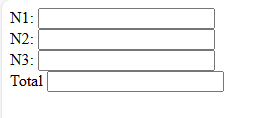
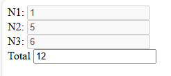

# javascript-SomaSimples-OnBlur
uma soma simples feita em aula com alguns elementos em javascript
  

  <h3>Você coloca os números nos inputs pra somar e quando tira o mouse de dentro deles, a soma começa e tranca o input</h3>
  

  
